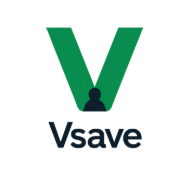

# Vsave



Vsave is a digital savings and wallet platform designed to help lottery (lotto) agents manage money seamlessly. The system features a tiered hierarchy for team management, robust saving and wallet functionalities, and a comprehensive admin console for managing all aspects of the platform.

---

## Features

-   **Team & User Management:** The platform provides a clear, competitive, and trackable hierarchy for team management, from General Admin down to individual Marketers. Marketers can onboard new users, and admins can set savings targets and monitor performance via leaderboards.
-   **Saving Management:** Users can set up daily, weekly, or monthly savings plans, as well as fixed savings products. The system includes a configurable admin fee structure and rules for handling insufficient funds and early withdrawals.
-   **Wallet & Overdraft Management:** Users are assigned a unique virtual account for instant deposits and can withdraw funds to any Nigerian bank account or another Vsave user. The platform also features an overdraft system with configurable eligibility rules, limits, and repayment plans.
-   **Bonus & Fraud Prevention:** A separate bonus wallet rewards users for manual cash deposits, referrals, and transfers. The system includes controls to prevent fraud, such as flagging double transfers and limiting daily bonus transfers.
-   **Accounting & Reporting:** A double-entry general ledger and automated journal posting engine ensure accurate financial records. The system provides real-time dashboards and downloadable reports for key metrics, including deposits, withdrawals, fees, and marketer performance.
-   **Risk Management:** A risk management framework is in place to ensure solvency, with features like liquidity pools, overdraft risk controls, and a user credit scoring algorithm to assess risk dynamically.

---

## Tech Stack

This project is built using the following technologies:

-   **React Native** - The framework for building native apps.
-   **Expo** - The toolchain for building and deploying React Native apps.
-   **TypeScript** - A typed superset of JavaScript for enhanced code quality.
-   **Node.js** - For backend services and development tools.

### Service Integrations

The Vsave platform integrates with several third-party services to ensure functionality, security, and compliance:

-   **Banking & Payments:** Wema Bank (ALAT APIs), Sterling Bank (PaywithSpecta), and GTBank (Squad) for virtual accounts, real-time payments, and transfers.
-   **KYC & Compliance:** SmileID for ID verification, face match, and sanctions screening to comply with CBN AML/CFT regulations.
-   **Communication:** A dual SMS provider strategy with Termii for OTP verification and SmartSMS for alerts and bulk messaging.

---

## Installation

Follow these steps to get the project up and running on your local machine.

1. **Clone the repository**

    ```bash
    git clone [https://github.com/OsinnowoDavid/VsaveFrontend.git](https://github.com/OsinnowoDavid/VsaveFrontend.git)
    ```

2. **Navigate to the project directory**

    ```bash
    cd Vsave
    ```

3. **Install the dependencies**

    ```bash
    npm install
    ```

    or

    ```bash
    yarn
    ```

---

## Usage

After installation, you can run the app in different ways:

-   **Run on a local development server**

    ```bash
    npm start
    ```

    This will open the Expo DevTools in your browser. From there, you can scan the QR code with the Expo Go app on your phone to see the app running on your device, or choose to run it on an iOS or Android simulator/emulator.

---

## Contributing

We welcome contributions to the Vsave project! To contribute, follow these steps:

1. Fork the repository.
2. Create a new branch (`git checkout -b feature/your-feature-name`).
3. Make your changes and commit them (`git commit -m 'Add a new feature'`).
4. Push to the branch (`git push origin feature/your-feature-name`).
5. Open a Pull Request.

---

## License

This project is licensed under the [MIT License](https://opensource.org/licenses/MIT).

---

## Contact

You can reach me via my GitHub profile at [https://github.com/OsinnowoDavid](https://github.com/OsinnowoDavid).
